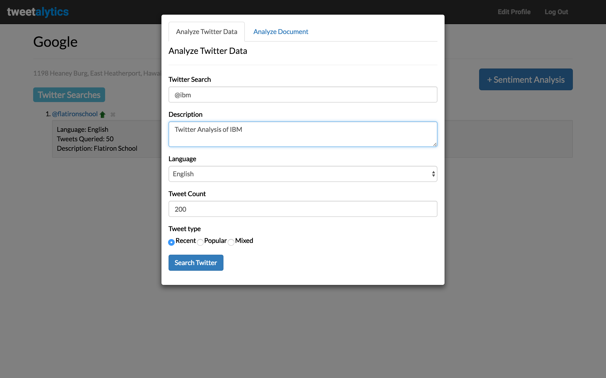
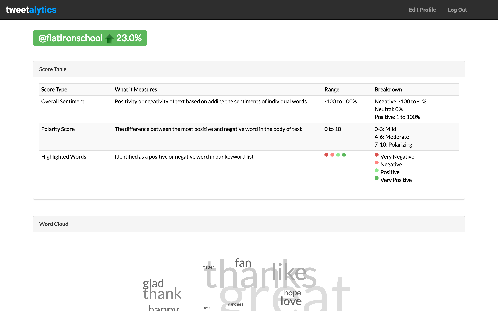
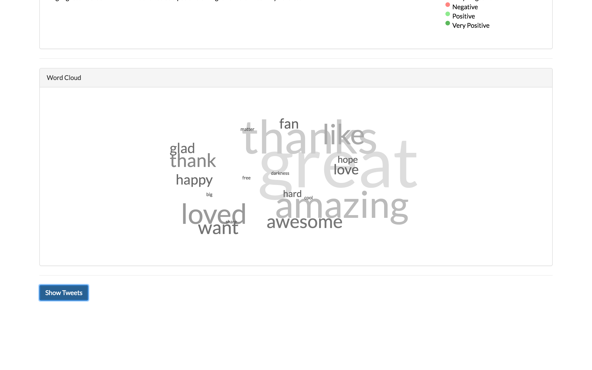
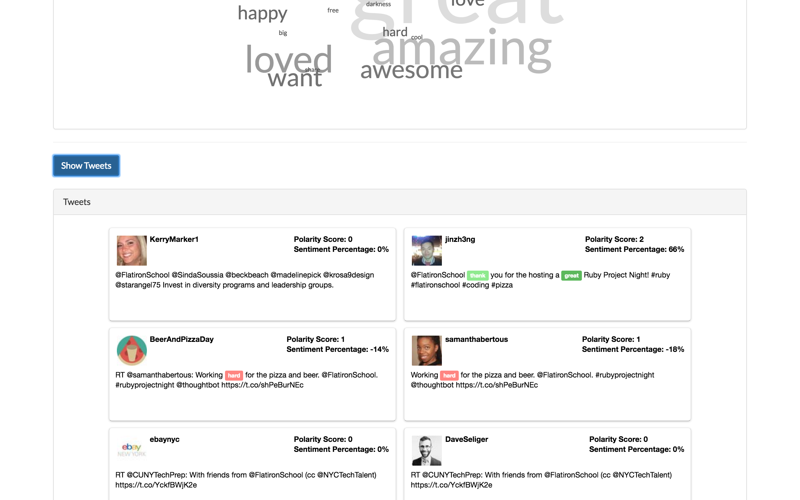

# Welcome to Tweetalytics

Tweetalytics is a Rails based sentiment analysis application that analyzes textual data and calculates sentiment scores based on a standard set of predefined words. Tweetalytics uses the following technologies: (1) Ruby, (2) Rails, (3) JavaScript, (4) jQuery, (5) D3.js, and the (6) Twitter API.

## Tweetalytics Sentiment Score Calculations

Sentiment scores are calculated by matching parsed text from either an amalgamation of tweets or inputted textual data, to words in the Tweetalytics word bank. The Tweetalytics word bank is a list of over 2,000 English words and emoticons with predefined scores ranging from -11 (negative words) to 11 (positive words).

In order to calculate sentiment scores, we've written various parsing and matching algorithms. Below, you will find a few code snippets that highlight the overall approach taken.

The main algorithm calls on various other methods to coerce the input data into manageable chunks of text before creating a sentiment score.

```ruby
def self.text_score(record)
  stripped_text = self.strip_text(record)
  split_text = self.words(stripped_text)
  word_count = self.word_count(split_text)
  keyword_count = self.keyword_values
  find_matches = self.find_matches(word_count, keyword_count)
  matched_values = find_matches.values
  self.create_sentiment(record, matched_values, split_text)
end
```
The following methods calculate the sentiment score, percentage, and polarity scores. Please see below for a brief explanation of the definitions of overall sentiment and polarity scores.

```ruby
def self.calculate_sentiment_percentage(split_text, sentiment_score)
  raw_score = (sentiment_score / split_text.length * 100).to_i * 2
  if raw_score > 100
    raw_score = 100
  elsif raw_score < -100
    raw_score = -100
  else
    raw_score
  end
end

def self.sentiment_score(matched_values)
  matched_values.reduce(:+) || 0
end

def self.split_polarity(matched_values)
  split_array = matched_values.partition { |rating| rating > 0 }
  positive_ratings, negative_ratings = split_array.first, split_array.last
end

def self.calculate_polarity(matched_values)
  positive_ratings, negative_ratings = split_polarity(matched_values)
  total_positive = positive_ratings.reduce(:+) || 0
  avg_p = positive_ratings.empty? ? total_positive : total_positive / positive_ratings.length
  total_negative = negative_ratings.reduce(:+) || 0
  avg_n = negative_ratings.empty? ? total_negative : total_negative / negative_ratings.length
  avg_p - avg_n
end

def self.create_sentiment(record, matched_values, split_text)
  polarity_score = self.calculate_polarity(matched_values)
  sentiment_score = self.sentiment_score(matched_values)
  sentiment_percentage = self.calculate_sentiment_percentage(split_text, sentiment_score)
  record.create_sentiment(sentiment_score: sentiment_score, polarity_score: polarity_score, sentiment_percentage: sentiment_percentage)
end
```

##### Definitions
* **Overall Sentiment Score:** positivity or negativity of text based on adding the sentiments of individual words.
* **Polarity Score:** the difference between the most positive and negative word in the body of text.

## Screenshots

Tweetalytics Homepage:


Search Modal:



Results Page:



Word Cloud using D3.js showing all of the matched words. The larger the word, the greater the amount of times the word was used in the input text.



Analyzed Tweets:



## Next Steps

In order to improve the overall accuracy of the sentiment scores, our next step is to integrate 5-star and 1-star reviews from Amazon and Yelp. By integrating words used in positive and negative reviews, Tweetalytics can "learn" new words that tend to be generally negative and generally positive, without the need to match textual data against a static word bank.

## Authors

* Sagar Patel: [LinkedIn](www.linkedin.com/in/patelsagar) | [GitHub](github.com/sagarpatel8384)
* Leah Einhorn: [LinkedIn](https://www.linkedin.com/in/leah-einhorn-36b05831) | [GitHub](github.com/itsatype)
* Mindy Yuan: [LinkedIn](www.linkedin.com/in/mindy-yuan-53218044) | [GitHub](github.com/mindyyuan)

## License

Tweetalytics is MIT Licensed. See LICENSE for details.
